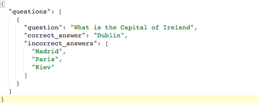

## Saving the quiz

Amazing! Now that you have all your questions you need somewhere to save them.

First you need to get the user to say what the quiz should be called.
+ Add another **Text** and **TextBox** (call it `quizNameInput`) element.


+ Underneath, add a **PushButton** element. For its function type `saveQuiz`.

+  Great! Now onto making that function. Go right ahead and set it up.

--- hints ---

--- hint ---

--- /hint ---

--- /hints ---

You are going to save the information in a format called **JSON**. With JSON you have keys and values. A value is given to a key, and when you want that value back you give json the key. This allows for your data to be saved and read easily. It looks like this:



+ Python has a built in JSON library (called `json`), so go ahead and import that:

```python
import json
```

You are going to store this json data in a file, but first you need a file name. You'll get this in the `saveQuiz` function. 

+ You need to get the user's input and then add `.json` to that, so the computer knows what file type it is.

```python
fileName = quizNameInput.value + “.json”
```

Now you need to create this file. Thankfully Python can do that easily! It has a built-in function named open for files. This has multiple options like **r - Read**, **a - Append**, **w - Write**, but since you need to create the file, **w+** is the best.

+ Add the following code
```python
with open(fileName, “w+”) as file:
    #Indented code
```

--- collapse ---
---
title: What's 'with' this code?
---

Notice that you used `with`. 

In python after you open a file, it needs to be closed. 

By using `with`, Python will automatically close it for you. This works like a function: once you unindent you will leave it and close the file.

--- /collapse ---

+ If you are going to be writing some JSON data, you first need to get it! You can use the `json` library to turn your questions list into JSON.

```python
jsonData = json.dumps(questions)
```

+ Great! Now you need to write it to the file:

```python
file.write('{"questions":' + jsonData + '}')
```

  All JSON data is first surrounded by parenthesis({), then you define the key(which is “questions”), add the json data, and finally close the parenthesis.

+ Perfect! Just unindent you code so the file can close!

+ The last thing to do would be to clear all of the TextBoxs, since you don’t need what’s in them anymore. This can be done like this:

```python
newQuestion.value = ""
```

+ Try it for the other 3 **TextBoxes**!

+ Brilliant! You now have a quiz generator. Try playing around with it and making up some quizzes.
